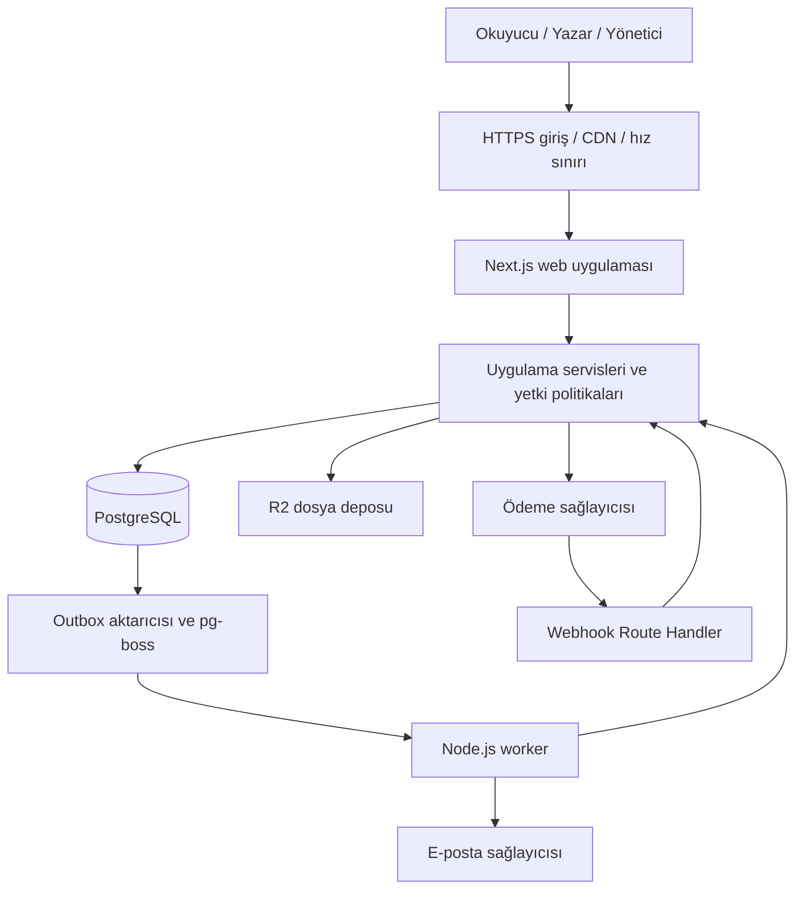
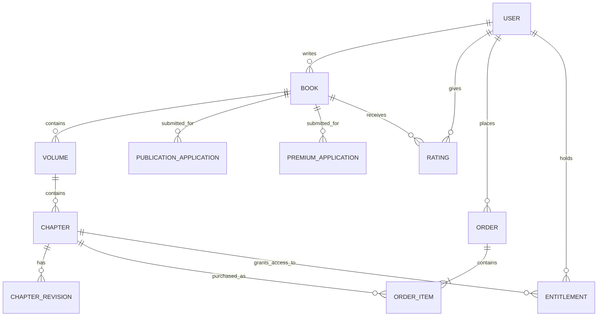

# Webnovel Platformu — Ürün Gereksinimleri ve Teknik Mimari

Son güncelleme: 17 Eylül 2026

Durum: Anime/manga arayüzü ve Prisma geçişi tamamlanmış çalışan sürüm; sonraki aşamalar için hedef mimari

Kapsam: Mevcut uygulama, ürün kuralları, teknoloji seçimi, veri modeli, uygulama sınırları ve geliştirme planı.

Bu doküman çalışan sürümü ve platformun hedef mimarisini birlikte tanımlar. Kullanıcının isteği doğrultusunda arayüz anime/manga odaklı bir webnovel deneyimine dönüştürülmüş, veri erişimi Drizzle'dan Prisma 7'ye taşınmıştır. Kurulum komutları ve kullanım akışları [README.md](./README.md) içindedir. Aşağıdaki mevcut durum tablosunda bulunmayan ödeme, worker, dosya yükleme ve gelişmiş moderasyon özellikleri hedef kapsamdır; uygulanmış özellik olarak değerlendirilmemelidir.

### Mevcut durum

| Alan | 17 Eylül 2026 itibarıyla çalışan kapsam |
| --- | --- |
| Arayüz | Koyu zemin, kırmızı vurgu, anime seri vitrini, altı seçilebilir illüstrasyon, yatay gezinme ve mobil menü. |
| Keşif ve okuma | Başlık/yazar araması, tür ve tamamlanma filtresi, puan sıralaması, kitap/cilt/bölüm ekranları, tema ve yazı boyutu tercihleri. |
| Kimlik | Better Auth ve Prisma adaptörü; kayıt, giriş, çıkış, veritabanı oturumları, doğrulama ve şifre yenileme için Resend bağlantısı. |
| Yazarlık | Kitap/cilt/bölüm oluşturma, Tiptap editörü, otomatik kayıt, sürüm çakışması kontrolü, taslak/canlı metin ayrımı. |
| İnceleme | Yayın ve premium başvuru anlık görüntüleri, yönetici onay/red işlemleri ve denetim kayıtları. |
| Topluluk | Kütüphane, bölüm bazlı okuma ilerlemesi, kitap puanı, kitap yorumu ve spoiler gizleme. |
| Veritabanı | Prisma Client; PostgreSQL için `@prisma/adapter-pg`, yerel PGlite için `pglite-prisma-adapter`; mevcut verileri koruyan migration geçişi. |
| Premium | Onay ve bölüm fiyatlandırması; eski ücretsiz bölümleri koruyan kurallar. Tahsilat ve satın alınmış erişim henüz yok. |
| Doğrulama | 24 iş kuralı/migration testi, TypeScript ve ESLint başarılı. Önceki UI/Prisma kontrolünde 3 Playwright testi ve üretim derlemesi başarılıydı; yönetici öz değerlendirme ve otomatik yayın değişiklikleri için tam paket yeniden çalıştırılmadı. DB testleri yerel PGlite üzerinde çalıştırıldı. |

Mevcut kullanıcı rolleri `reader` ve `admin` değerleridir; yazarlık kitap sahipliğiyle belirlenir. Aşağıdaki ayrıntılı rol, ödeme ve operasyon bölümleri ileride uygulanacak daha geniş modeli de içerir. Belirtilmeyen ürün davranışları **önerilen ürün kararı** olarak tasarlanmıştır.

## 1. Ürün ve başlangıç kararları

Platformda kullanıcılar kitap yazar, kitaplarını ciltlere (volume) ve bölümlere (chapter) ayırır. Kitaplar yayın başvurusu onaylandıktan sonra okuyucuya açılır. Okuyucular kitaplara 1–5 puan verir ve yorum yazar. Yazarlar ayrıca kitap bazında premium başvurusu yapar. Premium onayı, uygun bölümleri ücretli sunma yetkisi sağlar; her bölümün ücretli olması zorunlu değildir.

**Değişmez temel kural:** Bir kitabın premium onayından önce ilk kez yayımlanan bölümleri sonradan ücretli yapılamaz. Bir bölümü düzenlemek, başka cilde taşımak veya yeniden yayımlamak ilk yayın tarihini değiştirmez.

Başlangıç için önerilen kararlar:

| Konu | Karar |
| --- | --- |
| Pazar ve dil | İlk sürüm Türkçe; Türkiye ve TRY varsayımı. Ülke değişirse ödeme sağlayıcısı yeniden değerlendirilir. |
| İçerik hiyerarşisi | Kitap → cilt → bölüm; her bölüm tam olarak bir cilde bağlıdır. |
| Yazarlık | E-postasını doğrulayan kullanıcı yazar profili açabilir; kitap yayınlama onaya bağlıdır. |
| Kitap sahipliği | İlk sürümde kitap başına tek yazar; ortak yazarlık ve sahiplik devri sonraki sürüme bırakılır. |
| Yayın incelemesi | İlk kitap başvurusu incelenir; onaylı kitaba sonradan eklenen bölümler yazar tarafından yayımlanabilir. Şikâyet ve moderasyon devam eder. |
| Premium | Kullanıcıya değil kitaba verilen ayrı bir ticari yetkidir. Okuyucu aboneliği anlamına gelmez. |
| Satış modeli | Tek bölüm veya aynı kitaptan seçilmiş birden fazla bölümün tek ödemede satın alınması. |
| Erişim | Satın alınan bölüme süre sınırı olmadan platform üzerinden erişim; gelecek bölümler pakete kendiliğinden dahil olmaz. |
| İlk sürüm dışında | Coin/cüzdan, okuyucu aboneliği, bağış, otomatik bölüm satın alma ve farklı yazarlardan ortak sepet. |
| Altyapı | Tek kod deposu, modüler monolit, ayrı web ve worker süreçleri, tek PostgreSQL veritabanı. |

Örnek kitap: **3 cilt, toplam 100 bölüm**. İlk cilt 1–30, ikinci cilt 31–65, üçüncü cilt 66–100. Bölüm sayıları sabit değildir; yazar cilt ve bölüm ekleyebilir. Okuyucuya gösterilen sayılar yalnızca görünür yayımlanmış içerikten hesaplanır; taslak sayıları yazar panelinde ayrıca gösterilir.

## 2. Roller ve yetkiler

Roller bir kullanıcıda birleşebilir. İçerik sahipliği, rol kontrolüne ek olarak her işlemde doğrulanır.

| İşlem | Ziyaretçi | Okuyucu | Kitabın yazarı | Moderatör | Yönetici / finans |
| --- | --- | --- | --- | --- | --- |
| Kitap keşfetme, ücretsiz bölüm okuma | Evet | Evet | Evet | Evet | Evet |
| Kütüphane, puan, yorum | Hayır | Evet | Kendi kitabına puan veremez | Evet | Evet |
| Bölüm satın alma | Hayır | Evet | Kendi kitabında gerekmez | Normal satın alma kuralları | Normal satın alma kuralları |
| Taslak ve cilt düzenleme | Hayır | Hayır | Kendi kitabında | Hayır | Özel destek yetkisiyle |
| Yayın / premium başvurusu | Hayır | Hayır | Kendi kitabında | Hayır | Yazar adına rutin başvuru yapmaz |
| Yayın inceleme | Hayır | Hayır | Hayır | Atanmış başvurularda | Evet |
| Premium kararı | Hayır | Hayır | Hayır | Hayır | `premium.review` yetkisiyle |
| İçerik gizleme, şikâyet inceleme | Hayır | Hayır | Şikâyet edebilir | Evet | Evet |
| İade ve gelir işlemleri | Hayır | Kendi talebi | Kendi raporu | Hayır | `finance.manage` yetkisiyle |

Çalışan sürümde e-postası doğrulanmış yönetici, kendi kitabı dahil yayın ve premium başvurularını onaylayabilir veya reddedebilir. Karar gerekçesi, değerlendiren yönetici ve işlem kaydı saklanır; normal kullanıcılar değerlendirme yapamaz. Hedef moderatör rolü kendi kitabının başvurusunu değerlendiremez. Ücretli metne personel erişimi genel rol ayrıcalığı değildir; atanmış inceleme veya destek görevi gerektirir ve kaydedilir. Yönetici hesaplarında iki aşamalı doğrulama zorunludur.

## 3. Okuyucu, yazar ve yönetim özellikleri

### 3.1. Okuyucu deneyimi

- Ana sayfa: yeni güncellenenler, türler, tamamlanan kitaplar, editör seçkileri.
- Arama ve filtre: kitap adı, yazar, tür, etiket, dil, tamamlanma durumu ve ücretli bölüm içerme durumu.
- Kitap sayfası: kapak, özet, yazar, içerik uyarıları, puan ve oy sayısı, ciltlere ayrılmış bölüm listesi, fiyat ve kilit işaretleri.
- Okuma ekranı: açık/koyu/sepya tema, yazı boyutu, satır aralığı, genişlik, önceki/sonraki bölüm ve mobil kullanım.
- Kütüphane: takip edilenler, okunacaklar, okunuyor, tamamlandı; son bölüm ve okuma konumunu cihazlar arasında eşitleme.
- Bildirimler: takip edilen kitapta yeni bölüm, yorum yanıtı, satın alma sonucu. E-posta bildirimleri tercihe bağlıdır.
- Kitap puanlama, kitap ve bölüm yorumları, spoiler işareti, şikâyet etme.
- Satın alma geçmişi, erişimi açılmış bölümler, iade/destek başvurusu.

### 3.2. Yazar paneli

- Kitap profili, kapak, tür/etiket, dil, özgün eser/izinli çeviri bilgisi ve içerik uyarıları.
- Cilt ekleme ve sıralama; cilt içinde bölüm ekleme, sıralama ve taşıma.
- Zengin metin editörü, otomatik taslak kaydı, kelime sayısı, önizleme ve sürüm geçmişi.
- Anında veya zamanlanmış yayın; sunucuda doğrulanan yayın zamanı.
- Yayın ve premium başvuru durumu, inceleme notları ve yeniden başvuru.
- Uygun bölümler için fiyat belirleme; ücretli olmaya uygun olmayan bölümde açıklama gösterme.
- Okunma, takip, puan, satış ve iade istatistikleri. Okunma sayısı tahmini kullanım metriğidir, gelir hesabı değildir.
- Brüt satış, platform payı, sağlayıcı kesintisi, iade, bekleyen ve aktarılmış yazar geliri.

### 3.3. Yönetim paneli

- Yayın/premium başvuru kuyruğu, görev atama, sabitlenmiş başvuru içeriği ve gerekçeli karar.
- Kullanıcı, kitap, bölüm ve yorum şikâyetleri; işlem geçmişi ve itiraz başvurusu.
- İçerik gizleme, hesap kısıtlama, premium satış yetkisini durdurma.
- Tür/etiket ve editör seçkisi yönetimi.
- Ödeme, iade, aktarım ve mutabakat ekranları; başarısız işleri yeniden çalıştırma.
- Yetki değişikliği ve finans işlemlerini içeren denetim kayıtları.

### 3.4. Puan ve yorum kuralları

- Puan tam sayı olarak 1–5 arasındadır; kullanıcı-kitap çifti için tek aktif puan bulunur. Kullanıcı puanını güncelleyebilir veya kaldırabilir.
- İlk sürümde doğrulanmış hesap yeterlidir. Bölüm okuma telemetrisi tek başına gerçek okuma kanıtı sayılmaz.
- Yazar kendi kitabına puan veremez; kötü puanları ve eleştirel yorumları silemez. Moderasyon gerekçesiyle şikâyet edebilir.
- Puan ortalaması ve oy sayısı birlikte gösterilir. Sıralama için az oyla manipülasyonu azaltan ağırlıklı puan kullanılabilir; görünen ortalama değiştirilmez.
- Yorumlar kitap veya bölüm kapsamındadır. Bölüm yorumlarını okuma/yazma, ilgili bölüme erişim kontrolünden geçer; ücretli bölüm tartışmaları metni dolaylı olarak ifşa etmez.
- İlk sürüm bir seviye yanıtı destekler. Düzenlenmiş yorum etiketi, spoiler gizleme, hız sınırı ve moderasyon kaydı bulunur.

### 3.5. Uygulanan anime/manga tasarımı

Satır, metin tabanlı bir webnovel platformudur; anime/manga yönü görsel kimliği tanımlar. Manga sayfası yükleme veya çizgi roman panel okuyucusu bu sürümün parçası değildir.

- Ana sayfada tam genişlikte anime illüstrasyonu üzerinde öne çıkan serinin adı, özeti, yazarı, puanı ve okuma bağlantısı bulunur.
- Tür gezinmesini altı kitaplık seri rafı, son güncellenenler ve değerlendirme puanlarından hesaplanan sıralama izler.
- Masaüstünde yatay gezinme; mobilde açılır menü, arama ve iki sütunlu kitap rafı kullanılır. Mobil menü Escape ile kapanır ve klavye odağını menü düğmesine geri verir.
- Kitap detayları, hesap ekranları, yazar stüdyosu ve başvuru ekranları aynı koyu tema ve kırmızı vurgu dilini kullanır. Stüdyo formları ve editör içerik odaklı tutulur.
- Okuyucu varsayılan olarak koyu açılır; açık ve sepya temalar ile 16–28 piksel yazı boyutu tercihi çerezde saklanır. Bölüm içeriği serif yazı tipiyle, arayüz sans-serif yazı tipiyle gösterilir.
- `public/art/hero.png` seri vitrini için; `ember`, `ocean`, `forest`, `violet`, `sand` ve `rose` kapakları kitap görselleri için kullanılır. Bunlar dosya yükleme özelliği değil, yazarın seçebildiği yerel illüstrasyonlardır.
- Kapaklar `BookCover` üzerinden Next.js Image ile sunulur. Üretim yöntemi ve promptlar [ARTWORK.md](./public/art/ARTWORK.md) içinde kayıtlıdır.

Ana uygulama dosyaları: [globals.css](./src/app/globals.css), [shell.tsx](./src/components/shell.tsx), [page.tsx](./src/app/page.tsx), [book-cover.tsx](./src/components/book-cover.tsx) ve [reader.tsx](./src/components/reader.tsx).

## 4. Yayın ve premium iş akışları

### 4.1. Kitabın ilk yayın başvurusu

1. Yazar kitap bilgilerini, en az bir cildi ve en az bir tamamlanmış örnek bölümü hazırlar.
2. E-posta doğrulaması, gerekli alanlar ve hak sahipliği beyanı sunucuda kontrol edilir.
3. Başvuru gönderilirken kitap bilgileri ve incelenecek bölüm sürümleri bir başvuru anlık görüntüsüne bağlanır.
4. Yazar taslakları düzenlemeyi sürdürebilir; bu değişiklikler bekleyen başvuruya sessizce eklenmez. Başvuru geri çekilip yeni sürümle tekrar gönderilebilir.
5. Moderatör onaylar, düzeltme ister veya gerekçeyle reddeder.
6. Yönetici **Onayla ve yayımla** kararı verdiğinde kitap doğrudan `PUBLISHED` olur. Başvuru anlık görüntüsündeki en fazla üç örnek bölüm, incelenen başlık ve metinleriyle aynı transaction içinde yayımlanır; kitap kataloğa girer. Sonradan değişen taslaklar ve örnek dışındaki bölümler otomatik açılmaz. Gizlenmiş veya silinmiş örnek bölüm varsa karar ve yayın birlikte geri alınır. Her bölüm yayını ve başvuru kararı işlem kaydına yazılır.
7. Sonraki bölümler yazar tarafından yayımlanabilir. Kitabın temel konusu, hak sahipliği veya yaş sınıfını değiştiren güncellemeler yeniden incelemeye gider; karar verilene kadar mevcut onaylı profil gösterilir.

Başvuru durumları: `PENDING → IN_REVIEW → APPROVED | CHANGES_REQUESTED | REJECTED`; karar öncesi `WITHDRAWN` mümkündür. Yeniden başvuru eski kaydı değiştirmez, yeni bir kayıt üretir. Kitap başına aynı türde tek açık başvuru bulunur.

Kitabın yayın durumu: `DRAFT → PUBLISHED → ARCHIVED`; yayın başvurusu onayı ilk yayını da gerçekleştirir. Önceki akıştan kalan `APPROVED` kitaplar editörden incelenen bölüm yayımlanarak `PUBLISHED` yapılabilir. Moderasyon durumu ayrıca `CLEAR | HIDDEN` olarak tutulur. Hikâyenin yazım durumu da ayrı bir alandır: `ONGOING | COMPLETED | HIATUS | DROPPED`.

`ARCHIVED`, yeni keşif ve satışı durdurur. Önceden satın alanların erişimi korunur. `HIDDEN`, içerik ihlali nedeniyle okuyucu erişimini de engeller; varsa iade incelemesi başlatılır. Böylece hikâyenin bitmesi, satışın durması ve içeriğin kaldırılması birbirine karışmaz.

### 4.2. Premium başvurusu

Önerilen koşullar: yayımlanmış kitap, doğrulanmış yazar hesabı, açık kritik hak ihlali bulunmaması, sözleşme kabulü ve ödeme sağlayıcısında yazar için gerekli onboarding'in tamamlanması. Otomatik takipçi veya bölüm sayısı eşiği başlangıçta zorunlu değildir.

Premium başvurusu yayın başvurusundan bağımsız kayıt ve inceleme sürecidir. Onay sırasında:

- `premium_status = ACTIVE` yapılır.
- `first_premium_approved_at` yalnızca ilk onayda, veritabanı saatiyle yazılır ve sonradan değiştirilmez.
- Onaylayan kişi, başvuru, gerekçe ve geçerli ticari koşul sürümü kaydedilir.
- Hiçbir bölüm otomatik olarak ücretli yapılmaz.

Premium durumları: `NONE → ACTIVE → SUSPENDED | REVOKED`. Yeniden onayla `ACTIVE` durumuna dönülebilir; ilk onay tarihi korunur. Başvurunun bekleme/reddedilme bilgisi başvuru tablosunda tutulur, aktif bir yetkiyi yanlışlıkla ezmez.

### 4.3. Bölümün ücretli yapılabilmesi

Önerilen politika:

```text
canSetPaid =
  actor owns book
  AND book.publication_status == PUBLISHED
  AND book.moderation_status == CLEAR
  AND book.premium_status == ACTIVE
  AND author.payment_onboarding_status == VERIFIED
  AND chapter belongs to book
  AND chapter.status == PUBLISHED
  AND chapter.moderation_status == CLEAR
  AND chapter.first_published_at > book.first_premium_approved_at
  AND price is valid
```

`NULL` onay/yayın tarihleri uygun sayılmaz. Eşit zaman damgaları da “sonra” sayılmaz. Tarihler istemciden alınmaz. İlk yayın, premium onayı ve fiyatlandırma işlemleri aynı kitap satırını transaction içinde kilitler; kontrol ve yazma birlikte yapılır. İlk yayın ve ilk premium onay alanlarını değiştirmeyi veritabanı tetikleyicisi de engeller.

Taslak bölüm için `requested_access_type` ve `requested_price_minor` tutulabilir. Bölüm ilk kez yayımlanırken uygunluk kontrol edilip yayın ile fiyatlandırma aynı transaction içinde tamamlanır. Zamanlanmış bölümde ücretli yayın koşulları sağlanmıyorsa iş başarısız olur ve yazara bildirilir; bölüm izinsiz biçimde ücretsiz yayımlanmaz.

| Senaryo | Sonuç |
| --- | --- |
| Premium öncesi yayımlanmış bölüm | Daima ücretsiz kalır. |
| Premium öncesi taslak oluşturulmuş, onaydan sonra ilk kez yayımlanmış bölüm | Ücretli olabilir. Taslak oluşturma tarihi belirleyici değildir. |
| Premium öncesi yayımlanmış, sonra düzenlenmiş veya başka cilde taşınmış bölüm | Ücretli olamaz. |
| Premium sonrası ilk kez ücretsiz yayımlanmış bölüm | Sonradan ücretli yapılabilir; bu politika yazar ve okuyucuya açıkça gösterilir. |
| Premium sonrası ücretsiz okunmuş, daha sonra ücretli olmuş uygun bölüm | Önceki okuma kalıcı satın alma hakkı vermez. |
| Premium başvurusu bekleyen veya reddedilen kitap | Ücretli yayın yapılamaz. |
| Premium askıya alınmış kitap | Yeni ücretli yayın, yeni satış ve fiyat artırımı durur; satın alınmış erişimler korunur. |
| Askı süresinde ilk kez ücretsiz yayımlanan bölüm | İlk onaydan sonraysa, yetki yeniden aktif olduğunda ücretli olabilir. |
| Ücretli bölümün ücretsiz yapılması | Mevcut satın alma kaydı korunur; otomatik iade doğmaz. İade talepleri politika kapsamında incelenir. |
| Kitap tekrar premium onayı alır | İlk onay tarihi sıfırlanmaz; eski ücretsiz bölümlerin uygunluğu değişmez. |

Örnek: 100 bölümün ilk 60'ı premium onayından önce yayımlanmışsa 1–60 ücretsiz kalır. Onaydan sonra ilk kez yayımlanan 61–100, yazarın seçimine göre ücretsiz veya ücretli olabilir. Cilt sınırları bu kurala etki etmez.

İlk kez ücretli hale getirilecek bölümde eski ücretsiz metin önbelleği de dikkate alınır. Bu nedenle ilk sürümde bölüm gövdeleri, ücretsiz olsalar bile, ortak CDN/HTML/RSC önbelleğine konmaz. Daha önce okuyucuya teslim edilmiş metin geri alınamaz.

### 4.4. Bölüm sürümleri ve silme

Bölüm yayın durumu `DRAFT | SCHEDULED | PUBLISHED` olarak tutulur. Daha önce yayımlanmış bir bölümün yeni taslağı ayrı sürümdür; canlı bölümün durumu taslağa geri çevrilmez. Görünürlük `PUBLIC | UNLISTED`, moderasyon `CLEAR | HIDDEN`, satış durumu `OPEN | CLOSED` alanlarıyla ayrıca yönetilir. Yazar bir bölümü geri çektiğinde `UNLISTED/CLOSED` olur; mevcut alıcının erişimi devam eder. Yeni okur, yalnız doğrudan bağlantıyı bilerek bu bölüme erişemez.

- `Chapter` kimliği kalıcıdır; `ChapterRevision` metnin sürümünü tutar. Taslak düzenlemek canlı metni otomatik değiştirmez.
- Otomatik kayıtta `version` ile iyimser kilitleme kullanılır; iki sekmenin değişiklikleri sessizce birbirini ezmez.
- `published_revision_id`, okuyucunun göreceği sürümü gösterir. Yayınlanmış eski sürümler inceleme için korunur.
- Satış görmüş bölümler fiziksel silinmez. Yazar satıştan kaldırabilir; mevcut alıcı erişimini tek taraflı olarak yok edemez.
- Yeni sürüm yayımlanırsa satın alma hakkı aynı bölümün güncel sürümüne devam eder. Büyük içerik değişiklikleri şikâyet ve geri alma sürecine tabidir.
- Eski ücretsiz bölümün yeni kimlikle tekrar yüklenerek ücretli satılması politika ihlalidir. İçerik hash'i/yakın benzerlik uyarıları ve moderasyon bunu destekler; yalnız tarih kontrolü kopyalamayı engellemez.

## 5. Teknoloji seçimi

Sürüm politikası: Proje npm kullanır; bağımlılıklar `package-lock.json` ile sabitlenir ve `npm ci` ile kurulur. Çalışan sürüm Next.js 16, React 19, TypeScript ve Prisma 7 kullanır; Node.js 22.17+ gerekir. Kesin paket sürümleri için `package.json` ve kilit dosyası esas alınır. Aşağıdaki tablo çalışan teknolojileri ve ayrıca belirtilen hedef servisleri kapsar.

| Katman | Seçim | Neden / sorumluluk |
| --- | --- | --- |
| Web ve sunucu | Next.js App Router + React + TypeScript, Node.js runtime | SEO, okuyucu ekranları, paneller ve sunucu işlemleri aynı uygulamada. |
| Arayüz | Tailwind CSS altyapısı + global CSS + özel React bileşenleri + Lucide | Anime/manga görsel kimliği, paylaşılan formlar, okuyucu ve mobil gezinme. shadcn/ui kullanılmıyor. |
| Doğrulama | Zod | Sunucuda komut ve form doğrulaması; istemci kontrolleri yalnızca kullanıcı deneyimi içindir. |
| Kimlik | Better Auth + veritabanı oturumları | E-posta/parola, doğrulama, parola sıfırlama; ileride sosyal giriş. |
| Veritabanı | PostgreSQL | İlişkiler, transaction, benzersizlik ve finans kayıtları. |
| Veri erişimi | Prisma ORM + Prisma Migrate + `@prisma/adapter-pg` | Prisma şeması, tip güvenli istemci, kontrollü SQL migration'ları ve açık transaction sınırları. |
| Editör | Tiptap'ın açık kaynak çekirdeği | Yapılandırılmış metin; ilk sürümde ortak canlı düzenleme gerekmez. |
| İş kuyruğu | Hedef: pg-boss + ayrı Node.js worker | Zamanlanmış yayın, e-posta, mutabakat ve yeniden deneme; henüz uygulanmadı. |
| Dosyalar | Mevcut: `public/art/`; hedef: Cloudflare R2 | Yerel anime illüstrasyonları mevcut; kapak/avatar yükleme henüz yok. Bölüm metni veritabanında kalır. |
| E-posta | Mevcut: doğrudan Resend API; hedef: `EmailProvider` ve kuyruk | Hesap doğrulama ve şifre yenileme bağlantıları mevcut; kalıcı teslim kuyruğu henüz yok. |
| Ödeme | Türkiye varsayımında iyzico Pazaryeri, `PaymentProvider` adaptörü arkasında | Tahsilat ve yazara gelir aktarımı için pazaryeri modeli. Ticari uygunluk ayrıca doğrulanır. |
| Arama | Mevcut: parametreli `ILIKE`; hedef: `pg_trgm` indeksleri | Başlık/yazar araması, filtreler ve puan sıralaması; ayrı arama servisi yok. |
| Test | Vitest + PGlite üzerinde Prisma entegrasyonu + Playwright | İş kuralları, migration, yarış koşulları ve tarayıcı akışları; ayrı PostgreSQL sunucusunda doğrulama sonraki dağıtım kontrolüdür. |
| Çalıştırma | Docker, yönetilen container barındırma, yönetilen PostgreSQL | Web ve worker için ayrı süreç, ortak sürümlenmiş kod. |
| CI | GitHub Actions | Tip/lint/test/build ve kontrollü migration/deploy. |
| Gözlemleme | Yapılandırılmış JSON logları, OpenTelemetry, hata takip adaptörü | İstek/iş/ödeme kimliğiyle hata ve gecikme takibi. |

Better Auth'ın Next.js ve Prisma entegrasyonları vardır; kimlik ve oturum yönetimi kütüphaneye, kitap sahipliği ve premium kuralları uygulamanın servislerine aittir. Kaynaklar: [Next.js entegrasyonu](https://better-auth.com/docs/integrations/next), [Prisma adaptörü](https://better-auth.com/docs/adapters/prisma).

Yayın servisleri Prisma interactive transaction desteğini kullanır. Yayın, başvuru kararı, bölüm sürümü ve fiyat değişiklikleri kitap satırını `SELECT ... FOR UPDATE` ile kilitler; yetki kontrolü ve yazma aynı işlem içinde yapılır. Gelecekteki hak ve finans değişiklikleri de bu transaction yaklaşımını izler. [Prisma transaction dokümanı](https://www.prisma.io/docs/orm/prisma-client/queries/transactions).

pg-boss, PostgreSQL üzerinde iş kuyruğu ve zamanlama sağlar. Bu tasarımda ilk aşamada Redis/BullMQ gerekmiyor; buna rağmen işleyiciler tekrar çalışmaya dayanıklı yazılır. [pg-boss deposu](https://github.com/timgit/pg-boss).

Tiptap içeriği JSON olarak saklanır; yalnız izinli düğüm ve işaretler render edilir. [Tiptap çıktı biçimleri](https://tiptap.dev/docs/guides/output-json-html). R2'ye yükleme için kısa süreli imzalı URL kullanılabilir; yayımlanmamış dosyalar özel tutulur. [R2 imzalı URL dokümanı](https://developers.cloudflare.com/r2/api/s3/presigned-urls/). E-posta adaptörü Next.js uyumlu Resend API'sini kullanır. [Resend entegrasyonu](https://resend.com/docs/send-with-nextjs).

### 5.1. Prisma şeması ve migration akışı

- Tek şema kaynağı [prisma/schema.prisma](./prisma/schema.prisma) dosyasıdır. `@map` ve `@@map`, mevcut PostgreSQL tablo/kolon adlarını korur; geçiş tablo yeniden oluşturmayı gerektirmez.
- Prisma Client `src/generated/prisma/` içine üretilir ve sürüm kontrolüne alınmaz. `npm ci` sonrasında ve üretim derlemesinden önce otomatik üretilir; elle üretim komutu `npm run db:generate` şeklindedir.
- [src/db/index.ts](./src/db/index.ts), yeniden kullanılan Prisma istemcisini oluşturur. `DATABASE_URL` varsa PostgreSQL adaptörü; yoksa yalnız `LOCAL_DATABASE=true` koşulunda yerel PGlite adaptörü seçilir.
- Better Auth `prismaAdapter(..., { provider: "postgresql" })` kullanır. Oturum, katalog, topluluk, yayın, seed ve yönetici komutları Prisma'ya taşınmıştır. Drizzle paketleri ve eski şema/config dosyaları kaldırılmıştır.
- Katalog istatistikleri, satır kilitleri ve atomik hız sınırı gibi SQL gerektiren işlemler Prisma'nın parametreli SQL API'sini kullanır; kullanıcı girdisi SQL metnine birleştirilmez.

| Komut | İşlev |
| --- | --- |
| `npm run db:generate` | Şemadan Prisma Client üretir; migration oluşturmaz. |
| `npm run db:dev -- --name degisiklik_adi` | PostgreSQL geliştirme veritabanında Prisma Migrate ile yeni migration oluşturur ve uygular. |
| `npm run db:migrate` | Kontrol edilmiş SQL migration'larını seçili ortama uygular; PostgreSQL'de `prisma migrate deploy` çağırır. |
| `npm run db:seed` | Kitap bulunmayan veritabanına örnek içerik ekler. |
| `npm run db:admin -- kayitli@adres.com` | Var olan, doğrulanmış kullanıcıya yönetici rolü verir. |

PGlite, Prisma CLI için ağ üzerinden PostgreSQL bağlantısı sunmaz. Bu yüzden [migrate-local.ts](./src/db/migrate-local.ts), aynı `prisma/migrations/` SQL dosyalarını transaction içinde çalıştırır ve standart `_prisma_migrations` geçmişini kaydeder. PGlite kullanılırken web sunucusu migration/seed/CLI işlemlerinden önce durdurulur; aynı veri klasörüne iki süreç bağlanmaz.

Eski Drizzle migration tablosu yalnız geçişin doğrulanması için okunur. Bilinen ilk iki migration'ın LF/CRLF hash'leri doğrulanır; uygulanmış dosyalar yeniden çalıştırılmadan Prisma geçmişine alınır. Tanınmayan eski geçmişte geçiş durur. Yerel Prisma migration geçmişinde eksik tamamlanma veya değişmiş checksum varsa işlem de durdurulur. SQL dosyaları `.gitattributes` ile LF satır sonuna sabitlenmiştir.

SQL migration'larındaki kısmi benzersiz başvuru indeksi, fiyat/içerik kontrolleri ve değişmez tarih tetikleyicileri korunur. Bölümün cilt ve kitap ilişkisini doğrulayan bileşik foreign key Prisma şemasında da temsil edilir. Mevcut ilk yayın/onay zamanı güncellemede yeniden yazılmaz; eski PostgreSQL kayıtlarının mikrosaniye hassasiyeti korunur. `prisma db push`, incelenmiş migration'ların ve bu özel SQL kurallarının yerine kullanılmaz.

## 6. Uygulama mimarisi

### 6.1. Modüler monolit

Başlangıçta ayrı bir NestJS API, mikroservis ağı veya Kubernetes kurulmaz. İş kuralları Next.js sayfalarına gömülmez; bağımsız TypeScript modüllerinde tutulur. Aynı modülleri web süreci ve worker çağırır. Böylece zamanlanmış yayın, elle yayınla aynı kuralları uygular.



Bağımlılık yönü: `app → application services → domain policies → repository/provider interfaces`. Prisma ve dış servis adaptörleri bu arayüzleri uygular. Domain kuralları Next.js, ödeme SDK'sı veya UI bileşenlerini import etmez. Modüller birbirinin tablolarına gelişigüzel yazmaz; ilgili uygulama servisini çağırır.

| Modül | Sahip olduğu sorumluluk |
| --- | --- |
| `identity` | Oturum, kullanıcı profili, roller, hesap kısıtları |
| `catalog` | Kitap/cilt/bölüm kimliği, metadata, tür/etiket, keşif |
| `publishing` | Taslak, sürümler, yayın başvurusu, ilk yayın ve zamanlama |
| `premium` | Premium başvurusu, onay geçmişi, ücretlendirme uygunluğu |
| `community` | Puan, yorum, şikâyet referansları |
| `library` | Takip, okuma listesi ve ilerleme |
| `commerce` | Sipariş, ödeme, erişim hakkı, iade, gelir ve aktarım |
| `moderation` | İnceleme görevleri, içerik gizleme, itiraz |
| `notifications` | Uygulama içi bildirim, e-posta tercihi ve teslim işleri |
| `audit` | Yetkili işlemlerin değiştirilemez denetim kaydı |

### 6.2. Mevcut ve hedef dosya yapısı

Çalışan uygulama:

```text
webnovel-gpt6/
├── src/
│   ├── app/                      # Keşif, kitap, okuyucu, hesap, studio, admin
│   ├── components/               # Shell, kapak, formlar, Tiptap ve okuyucu
│   ├── db/
│   │   ├── index.ts              # Prisma Client ve bağlantı adaptörleri
│   │   ├── schema.ts             # Ortak TypeScript tipleri; ORM şeması değil
│   │   └── migrate-local.ts      # PGlite migration ve geçmiş doğrulaması
│   ├── generated/prisma/         # Üretilir; Git dışında
│   ├── lib/                      # Better Auth, oturum ve yardımcılar
│   └── modules/
│       ├── catalog/              # Katalog, bölüm listesi, yorum ve kütüphane sorguları
│       ├── publishing/           # İçerik doğrulama, politikalar, servis ve actions
│       └── community/            # Kaydetme, puan, yorum ve ilerleme actions
├── prisma/
│   ├── schema.prisma
│   └── migrations/               # Başlangıç SQL'i ve yayın değişmezlik kuralları
├── public/art/                   # Anime kapakları, vitrin ve ARTWORK.md
├── scripts/                      # Migration, seed ve yönetici CLI
├── tests/                        # Yayın ve migration testleri, e2e/
├── prisma.config.ts
├── compose.yaml
├── package-lock.json
└── README.md
```

Worker, ödeme, dosya yükleme ve modül ayrımı genişlediğinde kullanılacak hedef yapı:

```text
webnovel/
├── src/
│   ├── app/
│   │   ├── (public)/              # Keşif, kitap, yazar profili
│   │   ├── (reader)/              # Okuma, kütüphane, satın almalar
│   │   ├── (auth)/                # Giriş, kayıt, doğrulama
│   │   ├── studio/                # Yazar paneli
│   │   ├── admin/                 # İnceleme ve finans
│   │   └── api/
│   │       ├── auth/[...all]/
│   │       ├── payments/callback/
│   │       ├── webhooks/iyzico/
│   │       └── uploads/
│   ├── modules/
│   │   ├── publishing/
│   │   │   ├── domain/            # Durum geçişleri, saf politikalar
│   │   │   ├── application/       # Komutlar, sorgular, transaction sınırı
│   │   │   ├── infrastructure/    # Repository uygulamaları
│   │   │   └── ui/                # Editör ve ilgili bileşenler
│   │   ├── commerce/
│   │   ├── premium/
│   │   └── ...
│   ├── components/ui/
│   ├── db/                       # Prisma bağlantısı ve veri erişim yardımcıları
│   ├── generated/prisma/         # Şemadan üretilen istemci
│   ├── lib/                      # Auth, config, log, ortak altyapı
│   └── worker/                   # Başlatıcı, outbox, job handler'ları
├── prisma/                       # schema.prisma ve incelenen SQL migration'ları
├── prisma.config.ts
├── tests/{unit,integration,e2e}/
├── Dockerfile
├── compose.yaml                  # Yerel PostgreSQL ve servisler
├── .env.example                  # Yalnız değişken adları/örnekler
├── package-lock.json
└── WEBNOVEL_MIMARI.md
```

İkinci ağaç hedef yapıdır; worker, commerce, ödeme route'ları ve Dockerfile henüz mevcut değildir. İlk ağaç çalışan depoyu gösterir.

### 6.3. Next.js veri ve erişim sınırları

- Server Components, sorgu servislerini sunucuda doğrudan çağırır; kendi Route Handler'ına HTTP isteği atmaz.
- Form mutasyonları Server Actions kullanır. Ödeme webhook/callback ve dosya yükleme Route Handlers üzerinden yürür.
- Her giriş noktasında oturum, yetki, sahiplik ve Zod doğrulaması yapılır. Worker işlemleri kısıtlı sistem aktörüyle aynı servisleri çağırır.
- Layout veya yönlendirme koruması tek başına yetkilendirme değildir. Güvenlik kontrolü veriye erişen servis katmanındadır. Bu yaklaşım Next.js'in [kimlik ve DAL rehberiyle](https://nextjs.org/docs/app/guides/authentication) uyumludur.
- İstemciye açık DTO'lar yalnız gereken alanları taşır. Sipariş kimliği, kullanıcı rolü ve fiyat istemciden geldi diye güvenilir sayılmaz.
- `getChapterForReader(actor, chapterId)` erişim kararından sonra metni okur. Liste sorguları yalnız başlık, sıra ve kilit bilgisi döndürür.
- Taslak/ücretli tam metin; metadata, Open Graph, JSON-LD, arama indeksi, log, herkese açık API veya istemciye önceden gönderilen gizli bir alan içinde bulunmaz.
- Katalog metadata'sı ortak önbelleğe uygundur. Bölüm gövdeleri, hesap ekranları ve satın alma sorguları dinamik ve `private, no-store` politikasıyla sunulur; statik üretim, ortak `use cache` veya CDN cache kuralına dahil edilmez.
- Fiyat/yayın/moderasyon değişiminde ilgili katalog cache'i geçersiz kılınır. Ödeme ve erişim kararlarında ana veritabanı kullanılır; gecikebilen replikaya güvenilmez.

Next.js'in cache davranışı kullanılan yapılandırmaya göre değişir; kurulumda açık cache sınırları seçilip test edilir. [Next.js caching dokümanı](https://nextjs.org/docs/app/getting-started/caching).

## 7. Veri modeli

Bu bölümün ER diyagramı ve geniş tablo listesi hedef veri modelini anlatır. Mevcut şema `User`, `Session`, `Account`, `Verification`, `Book`, `Volume`, `Chapter`, `ChapterRevision`, `Application`, `Rating`, `Comment`, `LibraryEntry`, `ReadingProgress`, `AuditLog` ve `RateLimit` modellerinden oluşur.

Çalışan sürümde yayın ve premium başvuruları ayrı tablolar yerine `applications.type = PUBLICATION | PREMIUM` ile tutulur; başvuru durumları `PENDING | APPROVED | REJECTED` değerleridir. Bölümün `content` alanı taslağı, `publishedContent` ve `publishedTitle` alanları canlı sürümü taşır. Geçmiş sürümler `chapter_revisions`, başvuru örnekleri değişmez JSON anlık görüntüsü içinde saklanır. Bölüm durumları `DRAFT | PUBLISHED`, hikâye durumları `ONGOING | COMPLETED | HIATUS` değerleridir. Sipariş, erişim hakkı, finans ve bildirim tabloları henüz oluşturulmamıştır.

### 7.1. Temel ilişkiler



### 7.2. Tablolar ve kritik alanlar

Tüm iş tablolarında UUID kimlikleri, uygun foreign key'ler ve `timestamptz` zaman alanları kullanılır. Zamanlar UTC tutulur; kullanıcı arayüzünde saat dilimine dönüştürülür. Para, kayan noktalı sayı yerine kuruş gibi en küçük para biriminde tam sayı ve para birimi koduyla saklanır.

| Tablo / grup | Ana alanlar ve amaç |
| --- | --- |
| `users`, auth tabloları | Better Auth uyumlu kullanıcı, session, account ve verification kayıtları; hesap durumu. |
| `user_roles`, `author_profiles` | Çoklu roller, yazar görünen adı ve biyografisi; özel ödeme bilgisi ayrı tutulur. |
| `books` | `author_id`, `slug`, başlık, özet, dil, kapak, yayın/moderasyon/yazım durumu, `premium_status`, `first_premium_approved_at`, `version`. |
| `book_revisions` | İncelemeye giden kitap profilinin değişmez sürümü; `published_revision_id` ile canlı profil ayrımı. |
| `genres`, `tags`, bağlantı tabloları | Yönetilen sınıflandırma ve çoktan çoğa kitap bağlantıları. |
| `volumes` | `book_id`, başlık, açıklama, `position`; yayımlanmamış içeriklerden bağımsız liste sırası. |
| `chapters` | `book_id`, `volume_id`, başlık, `position`, yayın/görünürlük/moderasyon/satış durumu, `scheduled_at`, `first_published_at`, `published_revision_id`, `access_type`, fiyat, istenen yayın fiyatı, `version`. |
| `chapter_revisions` | `chapter_id`, sürüm numarası, editör JSON'u, türetilmiş düz metin, kelime sayısı, içerik hash'i, oluşturucu. |
| `publication_applications` | Kitap, başvuru sahibi, inceleyen, durum, kitap sürümü ve örnek bölüm sürümleri, karar gerekçesi, zamanlar. |
| `premium_applications`, `premium_events` | Başvuru/sözleşme sürümü, karar ve onay/askı/iptal/yeniden etkinleştirme geçmişi. |
| `ratings` | `user_id`, `book_id`, `score`; tek aktif puan. |
| `comments` | `user_id`, `book_id`, isteğe bağlı `chapter_id`, `parent_id`, metin, spoiler/düzenleme/moderasyon durumu. |
| `library_entries`, `reading_progress` | Kullanıcı-kitap listesi ve son bölüm, sürüme bağlı konum, güncelleme zamanı. |
| `orders`, `order_items` | Kullanıcı, kitap, toplam, para birimi, durum; kalemde bölüm, satın alma fiyatı, yazar ve ticari koşul anlık görüntüsü. |
| `purchase_reservations` | Kullanıcı-bölüm için aktif checkout rezervasyonu, ödeme girişimi ve sona erme/uzlaştırma bilgisi. |
| `payment_attempts`, `payment_events` | Sağlayıcı referansı, yerel idempotency anahtarı, ödeme durumu, doğrulanan olay ve işlenme bilgisi. |
| `entitlements`, `entitlement_events` | Kullanıcı-bölüm erişimi, kaynak sipariş kalemi, aktif/geri alınmış durumu ve geçmişi. |
| `refunds`, `refund_items` | İade isteği, sağlayıcı durumu, bölüm bazlı tutar ve neden. |
| `ledger_transactions`, `ledger_entries` | Değişmez, dengeli muhasebe hareketleri; sağlayıcı alacağı, yazar borcu, platform geliri, kesinti ve ters kayıtlar. |
| `author_payment_accounts`, `settlements` | Sağlayıcı alt üye referansı, doğrulama durumu ve sağlayıcıdan teyit edilen yazar aktarımı. |
| `reports`, `moderation_actions`, `appeals` | Şikâyet, hedef, işlem, gerekçe, itiraz ve sorumlu. |
| `notifications`, `notification_preferences` | Uygulama içi bildirim ve kanal tercihleri. |
| `audit_logs`, `outbox_events` | Yetkili işlem izi; transaction ile birlikte yazılan, dış işlere aktarılacak olaylar. |

### 7.3. Veritabanı kısıtları ve indeksler

- `UNIQUE(ratings.user_id, ratings.book_id)` ve `CHECK(score BETWEEN 1 AND 5)`.
- `UNIQUE(volumes.book_id, position)` ve `UNIQUE(chapters.volume_id, position)`; sıralama değişimleri transaction içinde yapılır.
- `chapters(volume_id, book_id)` için bileşik foreign key, başka kitabın cildine bölüm bağlamayı engeller. Yayınlanan sürümün de aynı bölüme ait olması bileşik foreign key ile korunur.
- Yorumun bölümünün kitaba, yanıtın da aynı yorum kapsamına ait olması servis ve ilişkisel kısıtlarla doğrulanır.
- `UNIQUE(chapter_revisions.chapter_id, revision_number)`; ilk yayın ve premium onay zamanları değişmezdir.
- Ücretli bölümde `price_minor > 0`; ücretsiz bölümde fiyat sıfırdır. Yayınlanmış bölümde yayın sürümü ve ilk yayın tarihi zorunludur.
- `UNIQUE(entitlements.user_id, chapter_id)`; hak olayları ayrı tutulur, iade sonrası tekrar satın almada aynı hak kaydı güvenli biçimde yeniden etkinleştirilir.
- Aktif checkout için `UNIQUE(user_id, chapter_id)` sağlayan rezervasyon; aynı bölümün eşzamanlı iki siparişe girmesi engellenir.
- Başvuru tablolarında açık durumlar için kısmi benzersiz indeks: kitap başına tek açık başvuru.
- Sağlayıcı ödeme referansı, yerel idempotency anahtarı ve işlenen olay anahtarı için uygun kapsamda benzersiz indeksler.
- `chapters(book_id, status)`, `chapters(status, scheduled_at)`, `comments(book_id, created_at, id)`, `orders(user_id, created_at, id)` ve açık moderasyon kuyruğu indeksleri.
- Hedef arama kitap/yazar adlarında trigram indekslerini kullanır; mevcut uygulama parametreli `ILIKE` sorgusu çalıştırır. Türkçe `i/ı/İ/I` normalizasyonu ayrıca doğrulanmalıdır. [PostgreSQL pg_trgm dokümanı](https://www.postgresql.org/docs/current/pgtrgm.html).
- Satış ve denetim ilişkilerinde zincirleme fiziksel silme kullanılmaz. Arayüzden kaldırma, finans kayıtlarının yok edilmesi anlamına gelmez.

Kitap premium durumu gibi tablolar arası kurallar sıradan `CHECK` kısıtına bırakılmaz. Servis transaction'ları, tutarlı kilit sırası ve gerekirse DB tetikleyicileriyle korunur. Uygulama kullanıcısı dışında doğrudan tablo yazma yetkisi sınırlandırılır.

## 8. Ödeme, erişim ve yazar geliri

### 8.1. Satış modeli ve sağlayıcı

İlk sürümde her ödeme tek kitap ve tek yazar içerir. Okuyucu birden fazla yayımlanmış ücretli bölümü seçebilir; toplam ve dahil olan bölüm listesi ödemeden önce gösterilir. Henüz yazılmamış bölümler veya gelecekte eklenecek ciltler satılmaz.

Tek bölümün fiyatı işlem maliyeti açısından çok düşük kalırsa aynı kitaptan toplu satın alma öne çıkarılır. Fiyat alt/üst sınırı, toplam minimumu ve platform komisyonu yönetilen ürün ayarlarıdır; sağlayıcı ücretleri belli olmadan kârlılık rakamı uydurulmaz.

Türkiye başlangıcı için iyzico Pazaryeri tercih edilir. Yazar, sağlayıcıda uygun alt üye kaydıyla eşlenir; sipariş kalemleri ilgili yazar ve gelir payıyla ilişkilendirilir. [iyzico alt üye kaydı](https://docs.iyzico.com/urunler/pazaryeri/pazaryeri-entegrasyonu/alt-uye-olusturma), [pazaryeri ödemesi](https://docs.iyzico.com/urunler/pazaryeri/pazaryeri-entegrasyonu/pazaryeri-odemesi).

Bu seçim, işletmenin ve dijital içerik modelinin sağlayıcı tarafından kabul edildiği varsayımına bağlıdır. Sandbox doğrulaması, ticari kabul, kullanılacak barındırılan ödeme ekranının pazaryeri uyumu ve aktarım koşulları ücretli sürümün yayın kapılarıdır. Kart numarası/CVV uygulama veritabanında tutulmaz; sağlayıcının barındırdığı ödeme arayüzü tercih edilir.

### 8.2. Satın alma akışı

1. Sunucu kullanıcının oturumunu, hesabını ve bölümlerin satış uygunluğunu kontrol eder. Zaten erişimi olan, ücretsiz, gizli, arşivlenmiş veya yazarın kendisine ait bölümler satılmaz.
2. Bölüm kimlikleri sıralanarak kilitlenir/rezervasyon alınır. Fiyatlar ve paylaşım koşulları veritabanından okunur; toplam sunucuda hesaplanır.
3. Sipariş ve kalemler fiyat anlık görüntüsüyle oluşturulur. Varsayılan teklif geçerliliği 15 dakikadır; sağlayıcı akışıyla uyumlu uygulanır.
4. Yerel ödeme girişimi kaydedilir; sağlayıcı çağrısı uzun DB transaction'ının dışında yapılır. Her girişimin korelasyon ve idempotency anahtarı vardır.
5. Okuyucu sağlayıcı ödeme ekranına gider. Tarayıcı başarı dönüşü yalnızca durum sorgusunu tetikler, erişim hakkı vermez.
6. Webhook veya güvenilir sunucu sorgusu doğrulanır. Sağlayıcıdan ödeme durumu, işyeri, sipariş referansı, tutar, para birimi ve kalem eşleşmesi teyit edilir.
7. Tek transaction içinde ödeme başarılı işaretlenir, sipariş kalemlerine erişim hakları açılır, muhasebe hareketleri ve outbox olayı yazılır.
8. Worker bildirim gönderir. Bildirim başarısız olsa bile satın alınmış erişim kaybolmaz.

Normal fiyat değişikliği mevcut geçerli teklifi değiştirmez. Premium satış yetkisi veya içerik görünürlüğü ödeme sırasında kapanırsa mevcut girişim yeniden değerlendirilir; tahsilat gerçekleşmişse otomatik iade sürecine alınır ve yasaklı içeriğe erişim verilmez.

### 8.3. Tekrarlanan olaylar ve belirsiz sonuçlar

Sipariş durumları `PENDING_PAYMENT → PAID | EXPIRED | CANCELLED`, tahsilat sonrası `PARTIALLY_REFUNDED | REFUNDED` olarak ilerler. Ödeme girişimleri ayrı olarak `CREATED | PENDING | SUCCEEDED | FAILED | UNKNOWN` durumlarını taşır; başarısız bir girişim sipariş için yeniden denemeyi engellemez. İade kayıtları `REQUESTED → PROCESSING → SUCCEEDED | FAILED` yolunu izler. Süresi dolmuş/iptal edilmiş siparişe geç tahsilat gelirse `RECONCILIATION_REQUIRED` istisna durumuna alınır; hak otomatik açılmadan sağlayıcı teyidi ve iade politikası uygulanır. Durum geçişleri tek servis üzerinden, denetim kaydıyla yapılır.

- Webhook imzası, seçilen iyzico ürününün formatına göre `X-IYZ-SIGNATURE-V3` ile doğrulanır; eski sürümler kullanılmaz. Hesapta imza özelliğinin etkinliği canlıya çıkmadan teyit edilir. [iyzico webhook dokümanı](https://docs.iyzico.com/ek-servisler/webhook).
- Doğrulanmış olay kalıcı olarak kaydedildikten sonra hızlı yanıt verilir; DB kaydı başarısızsa başarılı yanıt verilmez. İşleme worker tarafından tekrar denenebilir.
- Sağlayıcının tekil olay kimliği yoksa adaptör, ödeme referansı + olay türü + sağlayıcı durum/sürüm bilgisiyle deterministik tekrar anahtarı üretir. Ödeme ID'si tek başına tüm olayları ayırt etmeye yetmez.
- Aynı bildirim birçok kez gelse bile ikinci erişim hakkı veya ikinci gelir hareketi oluşmaz.
- Başarılı ödeme, daha sonra gelen eski `PENDING`/başarısızlık olayıyla geri alınmaz. Olay sırası belirsizse sağlayıcıdan güncel durum sorgulanır.
- Sağlayıcı çağrısı zaman aşımına uğrarsa körlemesine yeniden tahsilat başlatılmaz; mevcut girişimin durumu sorgulanır. Yerel idempotency, sağlayıcı tarafında aynı garantinin bulunduğu varsayımı değildir.
- Rezervasyonlar yalnız saat geçti diye serbest bırakılmaz; açık ödeme girişimi kapatılır veya mutabakat yapılır. Geç gelen ikinci tahsilat yine oluşursa benzersiz erişim kaydı korunur, fazla tahsilat iade kuyruğuna alınır.
- İade talebi tahsilatla yarışırsa hak önce açılıp yeniden satışa açık bırakılmaz; sipariş/ödeme durum makinesi ve aynı kayıt kilidi altında karar verilir.

### 8.4. Bölüme okuma erişimi

```text
canReadBody(actor, chapter):
  if actor has scoped author/reviewer preview permission:
    return preview through a separate audited path
  if actor account is blocked:
    return false
  if book or chapter is moderation-hidden:
    return false
  if chapter is not published:
    return false
  if actor has an active entitlement:
    return true  // sales suspension/archive does not erase a purchase
  return book is public AND chapter is public AND chapter.access_type == FREE
```

Premium askısı ücretli bölümleri otomatik ücretsiz yapmaz. Yeni kullanıcıya satış kapalı bilgisi gösterilir; mevcut alıcılar okumaya devam eder. Telif veya içerik ihlali nedeniyle moderasyonla gizleme ayrı bir karardır ve alıcılar için de erişimi engelleyebilir; destek/iade süreci bu nedenle gereklidir.

### 8.5. Gelir, aktarım ve iadeler

- Ticari koşul sürümü, bölüm fiyatı, platform payı ve yazar payı sipariş kaleminde sabitlenir. Sonraki oran değişikliği geçmiş satışları etkilemez.
- Önerilen paylaşım tabanı, siparişte gösterilen brüt bölüm bedelidir. Platform komisyonu baz puanla hesaplanır; kalan tutar yazar payıdır. İlk modelde sağlayıcı kesintisini platform karşılar. Vergi/muhasebe sınıflaması profesyonel değerlendirmeyle kesinleştirilir.
- Kuruş yuvarlama deterministiktir: brüt tutar = platform payı + yazar payı. Sağlayıcı kesintisi ve diğer teyit edilmiş giderler ayrıca kaydedilir.
- Muhasebe kayıtları çift taraflı ve para birimi bazında dengeli tutulur. Hata düzeltmeleri eski satırı düzenlemekle değil ters kayıtla yapılır.
- Yazar panelindeki “satış”, “bekleyen gelir”, “aktarılabilir gelir” ve “aktarıldı” birbirinden farklıdır. Ödeme başarılı olması yazara para aktarıldığını kanıtlamaz.
- Sağlayıcı tahsilat, iade ve aktarım raporları günlük olarak yerel kayıtlarla karşılaştırılır. Açık ödeme girişimleri daha sık kontrol edilir.
- İlk sürüm, sipariş kalemi bazında tam iadeyi destekler; tek bölüm bedelinin kısmi iadesi sonraki sürüme bırakılır. Aynı pakette yalnız bazı bölümler iade edilebilir.
- İade istenmesi erişimi hemen iptal etmez. Sağlayıcı iadeyi doğruladığında ilgili erişim kaydı geri alınır ve gelir ters kaydı oluşur. Diğer kalemler etkilenmez.
- Ters ibraz/chargeback için ayrı olay ve inceleme akışı bulunur. Önceden aktarılmış gelir varsa sağlayıcı sürecine göre alacak/mahsup kaydı açılır; geçmiş ödeme silinmez.
- Otomatik aktarım, sağlayıcının izin verdiği mekanizma ve sözleşme koşullarıyla yürütülür. Uygulama kendi başına genel amaçlı kullanıcı cüzdanı işletmez.

## 9. Sayfalar ve uygulama komutları

### 9.1. URL yapısı

Mevcut yollar: `/`, `/kesfet`, `/kitap/[slug]`, `/oku/[chapterId]`, `/giris`, `/kayit`, `/sifremi-unuttum`, `/sifre-yenile`, `/hesap`, `/kutuphanem`, `/hakkinda`, `/studio`, `/studio/yeni`, `/studio/books/[bookId]`, `/studio/books/[bookId]/chapters/[chapterId]` ve `/admin`. Başvurular kitabın stüdyo ekranından gönderilir, yönetici incelemesi `/admin` üzerinden yapılır. Auth route'u `/api/auth/[...all]` şeklindedir.

Aşağıdaki tablo hedef yolları da içerir; ayrı tür/yazar profili, satın alma ve yönetim alt sayfaları henüz uygulanmamıştır.

| Alan | Örnek yollar |
| --- | --- |
| Keşif | `/`, `/kesfet`, `/tur/[slug]`, `/yazar/[username]` |
| Kitap | `/kitap/[slug]` |
| Okuma | `/oku/[chapterId]` — sıra/cilt değişse de kalıcı bağlantı |
| Hesap | `/giris`, `/kayit`, `/hesap`, `/kutuphanem`, `/satinalmalar` |
| Yazar | `/studio`, `/studio/books/[bookId]`, `/studio/books/[bookId]/chapters/[chapterId]` |
| Başvurular | `/studio/books/[bookId]/publication`, `/studio/books/[bookId]/premium` |
| Yönetim | `/admin/applications`, `/admin/reports`, `/admin/payments`, `/admin/audit` |

Kitap slug'ı değişirse eski bağlantılar yönlendirme tablosuyla korunur. URL'de tahmin edilemeyen kimlik kullanılması yetki kontrolünün yerine geçmez.

### 9.2. Servis sözleşmeleri

Mevcut yayın servisleri `createBook`, `addVolume`, `addChapter`, `saveChapter`, `submitApplication`, `reviewApplication`, `publishChapter` ve `setChapterPrice` fonksiyonlarıdır. Kütüphane, puan, yorum ve ilerleme işlemleri `interactAction` ile yürür. Aşağıdaki komutlar genişletilmiş hedef sözleşmelerdir; ödeme ve zamanlama servisleri henüz yoktur.

| Komut / sorgu | Kritik kontrol |
| --- | --- |
| `submitPublicationApplication(bookId)` | Sahiplik, doğrulama, örnek sürümler, açık başvuru bulunmaması |
| `reviewPublicationApplication(applicationId, decision)` | İnceleme yetkisi, çıkar çatışması, başvuru sürümü, gerekçe |
| `publishChapter(chapterId, revisionId, expectedVersion)` | Kitap onayı, sahiplik, sürüm ilişkisi, ilk yayın tarihi ve istenen ücret |
| `scheduleChapter(chapterId, revisionId, at)` | Geçerli saat, sürüm; çalıştırma anında tüm yayın kuralları yeniden kontrol edilir |
| `approvePremium(applicationId)` | Yönetici yetkisi, onboarding, ilk onay tarihinin korunması |
| `setChapterPrice(chapterId, price, expectedVersion)` | Premium ve ilk yayın kuralı, fiyat aralığı, optimistic locking |
| `getChapterForReader(chapterId)` | Görünürlük, oturum/erişim hakkı, güvenli DTO |
| `rateBook(bookId, score)` | Doğrulanmış kullanıcı, 1–5, kendi kitabı olmaması |
| `createCheckout(chapterIds, idempotencyKey)` | Sunucu fiyatı, tek kitap, hak/rezervasyon kontrolü |
| `handlePaymentEvent(providerEvent)` | İmza, sunucu teyidi, tekrar anahtarı, atomik hak ve muhasebe |
| `requestRefund(orderItemIds, reason)` | Sipariş sahipliği veya finans yetkisi, iade edilebilir kalemler |

Hatalar kararlı kodlarla döner: `FORBIDDEN`, `REVISION_CONFLICT`, `PREMIUM_NOT_ACTIVE`, `CHAPTER_PREDATES_PREMIUM`, `ALREADY_OWNED`, `PAYMENT_PENDING`. Arayüz teknik kod yerine anlaşılır Türkçe açıklama gösterir.

## 10. Arka plan işleri ve veri tutarlılığı

Bir transaction içinde hem iş verisi hem `outbox_events` yazılır. Outbox aktarıcısı, olayları pg-boss'a taşır; gönderim ile işaretleme arasında çökme olduğunda aynı olay yeniden gönderilebilir. Tüketici, olay/iş kimliğine göre tekrar işlemeyi etkisiz hale getirir.

| İş | Davranış |
| --- | --- |
| Zamanlanmış yayın | Kaydedilmiş plan sürümünü doğrular; iptal edilmiş/eski planı çalıştırmaz. Kitap ve premium kurallarını tekrar uygular. |
| Yeni bölüm bildirimi | Yalnız ilk yayın olayı; aynı bölüm düzenlenince takipçilere tekrar tekrar gönderilmez. |
| E-posta | Tekrar deneme ve sağlayıcı referansı; kalıcı hatalar yönetim kuyruğuna alınır. |
| Ödeme mutabakatı | Belirsiz ödeme/iadeleri sorgular; doğrulanmış sonuç için ortak ödeme işleyicisini çağırır. |
| İstatistik | Tekil olaylardan sayaç/özet üretir; gerektiğinde ham kayıtlardan yeniden kurulabilir. |
| Dosya temizliği | Süresi dolmuş sahipsiz yüklemeleri kaldırır; canlı kapak ve satın alma verilerine dokunmaz. |

Worker yeniden başladığında vadesi geçmiş işleri yakalar. En az bir kez işlenme olasılığı uygulama tasarımında kabul edilir; dış yan etkiler için genel bir “tam bir kez çalışır” varsayımı yapılmaz. Finans işlerinde sessizce vazgeçmek yerine alarm ve manuel inceleme kaydı üretilir.

## 11. Güvenlik, içerik ve gizlilik

- Oturum cookie'leri HTTPS, HttpOnly ve uygun SameSite ayarlarıyla kullanılır. Yazma uçlarında origin/CSRF kontrolleri uygulanır; ödeme webhook'ları oturum yerine sağlayıcı doğrulaması kullanır.
- Kimlik, yorum, başvuru ve ödeme uçlarına merkezi hız sınırı uygulanır. Tek instance belleğine bağlı limit, ölçeklenince yeterli sayılmaz; ilk sürümde PostgreSQL sayaçları ve giriş katmanı limitleri kullanılır.
- Zengin metinde izinli şema/render uygulanır; keyfi HTML, script, iframe ve tehlikeli URL protokolleri engellenir. Yorumlar düz metin olarak güvenli render edilir.
- Kapak/avatar dosyalarında boyut, gerçek dosya türü ve piksel sınırı kontrol edilir; görseller yeniden kodlanır. MVP yüklemelerinde SVG/HTML kabul edilmez. Tarayıcıdan verilen dış URL'ler sunucuda serbestçe indirilmez.
- R2 yüklemeleri kullanıcıya ve tek nesne anahtarına bağlıdır. Yükleme tamamlanınca sunucu dosyayı doğrulamadan yayınlamaz.
- Loglarda bölüm gövdesi, parola, oturum token'ı, ödeme sırrı ve hassas yazar bilgisi bulunmaz. Finans için gerekli kimlik bilgisi mümkün olduğunca sağlayıcıda kalır.
- İnceleme, fiyatlandırma, premium kararı, yetki atama ve iade işlemlerinde aktör, hedef, neden, zaman ve korelasyon kimliği kaydedilir. Audit tablosuna uygulama rolüyle update/delete verilmez.
- Hak sahipliği beyanı, izinli çeviri belgesi, telif şikâyeti, spoiler/yaş uyarıları ve itiraz mekanizması ürünün parçasıdır.
- Kullanıcı hesabı silme isteği ile finans kayıtlarının saklanması ayrı süreçlerdir. İzin verilen veriler anonimleştirilir; saklama süreleri işletmenin yükümlülüklerine göre belirlenir.
- Kullanım koşulları, yazar sözleşmesi, içerik politikası, gizlilik ve dijital içerik iade metinleri ücretli lansman öncesinde tamamlanır. Bunların hukuki içeriği bu teknik dokümanda varsayılmaz.
- Okuyucuya gösterilen metnin kopyalanmasını tamamen engellemek mümkün değildir. Sağ tık engelleme gibi yöntemler yerine erişim kontrolü, kötüye kullanım tespiti ve şikâyet süreci kullanılır.

## 12. Performans, SEO ve erişilebilirlik

- Kitap ve yazar sayfaları sunucuda render edilir; başlık, açıklama, canonical, sosyal paylaşım görseli ve uygun yapılandırılmış veri hazırlanır.
- Sitemap yalnız açık kitap/yazar ve uygun açık içerik URL'lerini içerir. Panel, taslak, hesap ve tam ücretli içerik indekslenmez; `noindex` erişim kontrolü yerine kullanılmaz.
- Kilitli bölüm sayfası başlık ve yazarın onayladığı kısa tanıtımı gösterebilir; tam metin arama motoruna özel olarak açılmaz.
- Bölüm listeleri ve yorumlar sayfalanır; yüzlerce bölümün gövdesi tek istekte alınmaz. Yeni akışlarda `(created_at, id)` tabanlı cursor kullanılır.
- Kapaklarda uygun boyutlandırma ve tembel yükleme, okuyucu ekranında düşük JavaScript yükü hedeflenir.
- Editör kodu yalnız yazar panelinde yüklenir. Ücretli metne erişim kontrolü ile ücretsiz önizleme sorguları ayrıdır.
- Klavye kullanımı, görünür odak, ekran okuyucu etiketleri, kontrast ve hareket azaltma tercihi gözetilir. Okuma tercihleri yerelde ve giriş yapmış kullanıcı için hesapta saklanır.
- Başlangıç performans hedefleri: temsili yükte sunucu okuma yanıtı p95 < 500 ms; ödemeden hak açılmasına gecikme için sağlayıcı teyidinden itibaren p95 < 10 saniye. Bunlar ölçülecek hedeflerdir, mevcut sonuçlar değildir.
- Başlangıç yük testi senaryosu: 200 eşzamanlı okuyucu ve arka planda yayın/ödeme işleri. Sonuçlara göre kapasite belirlenir; donanım ölçülmeden kullanıcı kapasitesi taahhüt edilmez.

## 13. Dağıtım ve işletim

### 13.1. Ortamlar

- **Yerel:** Docker Compose ile PostgreSQL, Next.js ve worker; ödeme sandbox, e-posta test adaptörü.
- **Staging:** Üretimden ayrı veritabanı, bucket, anahtar ve webhook adresi; örnek içerik ve sandbox para hareketleri.
- **Production:** Aynı bölgede web/worker ve yönetilen PostgreSQL, HTTPS giriş katmanı, R2 ve dış sağlayıcılar.

İlk dağıtımda sürekli çalışan Node.js container'ları tercih edilir. Serverless web barındırma seçilirse worker yine ayrı sürekli çalışan ortamda tutulur. Birden fazla web instance'ına geçildiğinde cache invalidation, Server Action anahtarları ve dağıtım sürümü koordinasyonu ayrıca yapılandırılır. [Next.js self-hosting rehberi](https://nextjs.org/docs/app/guides/self-hosting).

### 13.2. Yayın hattı ve yedek

1. Pull request: lint, TypeScript kontrolü, ilgili unit/integration testleri ve production build.
2. Staging: migration, tarayıcı senaryoları, sandbox ödeme ve webhook testleri.
3. Production: tek seferlik migration işi, geriye uyumlu şema değişikliği, web/worker dağıtımı ve sağlık kontrolü.
4. Sorunda uygulama sürümü geri alınır. Veri silen şema değişiklikleri aynı deploy'da yapılmaz; genişlet → taşı → kaldır yaklaşımı kullanılır.

PostgreSQL bağlantı havuzları web ve worker toplamı üzerinden sınırlandırılır. Sağlık kontrolleri web yanıtını, DB bağlantısını ve worker kalp atışını ayrı ölçer.

Yönetilen PostgreSQL'de otomatik yedek ve zamana dönük kurtarma (PITR) seçilir. Hedef RPO 15 dakika, RTO 4 saattir; planın bunu karşılaması ve staging'e geri yükleme tatbikatıyla kanıtlanması gerekir. Nesne dosyaları için ayrıca yedekleme politikası belirlenir. Finans kayıtları kurtarma sonrası sağlayıcı raporlarıyla yeniden uzlaştırılır.

İzlenecek alarmlar: HTTP hata oranı, DB havuz doluluğu, kuyruk gecikmesi, gecikmiş yayınlar, webhook doğrulama hataları, uzun süre bekleyen ödemeler, muhasebe dengesizliği ve aktarım uyuşmazlıkları. Alarm ve loglarda kişisel veri azaltılır.

Altyapı giderleri: web/worker işlem gücü, PostgreSQL ve yedekler, nesne depolama/işlem/aktarım, e-posta, gözlemleme ve ödeme ücretleri. Kullanım ve sağlayıcı planı bilinmediği için sabit aylık bütçe verilmez. İlk maliyet optimizasyonu bölüm başına toplam veri boyutunu ve DB sorgu sayısını ölçmektir.

## 14. Test ve kabul kriterleri

### 14.1. Tamamlanan doğrulama

17 Eylül 2026 tarihli son uygulama kontrolü:

| Kontrol | Sonuç ve kapsam |
| --- | --- |
| `npm test` | 24 test başarılı: 21 yayın/içerik testi ve 3 migration testi. Otomatik yayın ve katalog görünürlüğü, incelenen sürümün korunması, gizli/eksik örnekte rollback, yöneticinin kendi kitabında karar verebilmesi, yetki sınırları ve işlem kayıtları kapsanır. Prisma Client ve geçici PGlite veritabanları kullanılır. |
| `npm run test:e2e` | Üretim derlemesi ve 3 Playwright testi başarılı. Keşif/arama/mobil okuma; kayıt/kütüphane/yorum/yayın/premium; ücretli metnin HTML/RSC/liste yanıtlarından korunması. |
| `npm run typecheck`, `npm run lint` | Başarılı. |
| Prisma şeması | Doğrulama ve istemci üretimi başarılı. |
| Migration geçişi | Mevcut yerel veriler korundu; tekrar çalıştırma, tanınmayan eski geçmiş ve checksum uyuşmazlığı test edildi. |
| Tarih hassasiyeti | Mikrosaniyeli eski ilk yayın zamanı yeniden yayında aynen korunuyor. |
| Görsel kontrol | Masaüstü ve mobilde ana sayfa, kitap detayları ve okuyucu incelendi; kapaklar yükleniyor, yatay taşma yok. |
| Mobil erişilebilirlik | Menü odağı, Escape ile kapatma ve açma düğmesine odak dönüşü test edildi. |
| Bağımlılıklar | Son `npm audit` kontrolünde 0 bilinen açık. |

Bu sonuçlar mevcut yerel doğrulama kaydıdır. Gerçek PostgreSQL sunucusu, üretim e-posta teslimi, yedekten dönüş, yük testleri ve uzak CI çalıştırması bu kontrolde doğrulanmış değildir.

### 14.2. Hedef kabul kriterleri

Saf iş kuralları unit test, transaction ve eşzamanlılık gerçek PostgreSQL entegrasyon testi, kullanıcı yolculukları Playwright ile doğrulanır. SQLite taklidi finans ve kilit davranışının testi için yeterli değildir.

| Senaryo | Beklenen sonuç |
| --- | --- |
| 3 cilt / 100 bölüm oluşturma ve sıralama | Her bölüm doğru ciltte görünür, toplam 100'dür, sıra değişince URL ve satın alma kimliği korunur. |
| Onaysız kitabı doğrudan API/Action ile yayımlama | Sunucuda reddedilir. |
| Başvurudan sonra taslak değiştirme | İnceleme ekranındaki gönderilmiş sürüm değişmez. |
| Premium öncesi bölümün fiyatını değiştirme | UI, doğrudan komut ve zamanlanmış işte reddedilir. |
| Onaydan önce hazırlanmış, sonra yayımlanan bölüm | Ücretli yayın koşullarını sağlıyorsa kabul edilir. |
| Premium onayıyla ilk yayın aynı anda | Kilit ve sunucu zamanına göre tek, tutarlı sonuç oluşur. |
| Eski bölümün düzenlenmesi/taşınması/yeniden yayını | İlk yayın tarihi değişmez; ücretli olmaya uygun hale gelmez. |
| İki sekmede aynı taslağın kaydı | Eski sürüm yazımı conflict verir; veri sessizce ezilmez. |
| Kullanıcı başka yazarın bölüm kimliğini gönderir | Okuma/düzenleme/satış işlemlerinde sahiplik kontrolü yapılır. |
| Yetkisiz ücretli metin isteği | HTML, RSC payload, JSON, metadata ve cache'te tam metin bulunmaz. |
| Kullanıcı A'nın satın alımından sonra kullanıcı B aynı URL'yi açar | A'nın metni B'ye önbellekten verilmez; çıkış sonrası da sızıntı olmaz. |
| Ücretsiz bölüm ücretli hale gelir | Önceki ortak body cache'i bulunmaz; yeni istekte erişim kontrolü uygulanır. |
| Aynı webhook 10 kez veya sıra dışı gelir | Tek geçerli finans sonucu ve tek erişim hakkı; eski olay sonucu geri almaz. |
| Sahte/yanlış tutarlı webhook | Hak açılmaz; olay reddedilir veya incelemeye alınır. |
| Aynı bölüm için iki eşzamanlı checkout | Tek aktif rezervasyon; fazla tahsilat olursa uzlaştırılıp iade edilir. |
| Tahsilat sonrası yerel işlem çöker | Tekrar işleme/mutabakat ile hak ve muhasebe atomik olarak tamamlanır. |
| İade sonrası aynı bölümü yeniden satın alma | Yeni sipariş ve gelir kaydı oluşur; tek erişim kaydı yeniden aktifleşir. |
| Premium askıya alınır veya kitap arşivlenir | Yeni satış durur, mevcut satın alımlar okunur. |
| İçerik ihlaliyle kitap gizlenir | Satış ve okuyucu erişimi kapanır; ilgili destek/iade kayıtları açılır. |
| Puan değiştirme ve kendi kitabına puan | İlkinde tek kayıt güncellenir; ikincisi reddedilir. |
| Worker kapanıp yeniden açılır | Vadesi geçen yayın yakalanır; aynı yayın/bildirim olayı çoğalmaz. |
| Yedekten kurtarma | Yayın sürümleri ve finans kayıtları geri gelir; sağlayıcıyla mutabakat yapılır. |

Ücretli lansmanın tamamlanma ölçütü: bu kritik senaryoların geçmesi, sandbox uçtan uca tahsilat/iade/aktarım akışının doğrulanması, destek/moderasyon araçlarının hazır olması ve sağlayıcı canlı hesap koşullarının tamamlanmasıdır. [Next.js production kontrol rehberi](https://nextjs.org/docs/app/guides/production-checklist) de dağıtım kontrollerine dahil edilir.

## 15. Geliştirme aşamaları

Mevcut durum: Aşama 1'in temel uygulama ve kimlik akışı çalışıyor. Aşama 2'de editör, başvuru ve yayın; Aşama 3'te keşif, okuyucu ve topluluk özellikleri hazır. Worker/zamanlama, gelişmiş moderasyon, bildirim ve operasyon kontrolleri bekliyor. Aşama 4'ten premium başvurusu ve fiyat uygunluğu uygulanmış olsa da ödeme, satın alınmış erişim ve gelir işlemleri henüz yok; bu aşama tamamlanmış sayılmaz.

### Aşama 1 — Temel altyapı ve kimlik

Next.js/TypeScript kurulumu, modül sınırları, PostgreSQL/Prisma migration'ları, Better Auth, e-posta doğrulama, roller, ortam yapılandırması, CI ve loglama.

Çıkış ölçütü: Kullanıcı kaydolur, doğrulanır, giriş yapar; yetkisiz yönetim ve başka kullanıcı verisine erişim engellenir.

### Aşama 2 — Yazarlık ve yayın

Kitap/cilt/bölüm, Tiptap editörü, autosave/sürümler, başvuru anlık görüntüsü, moderatör ekranı, yayınlama, worker/outbox ve zamanlama.

Çıkış ölçütü: 3 cilt/100 bölümlük örnek kitap doğru sırada hazırlanır; onaysız içerik yayınlanmaz, onaylanan kitap okunabilir.

### Aşama 3 — Okuyucu ürünü ve ücretsiz beta

Keşif, arama/filtre, okuma tercihleri, kütüphane/ilerleme, puan, yorum, spoiler, şikâyet, bildirim ve SEO.

Çıkış ölçütü: Uçtan uca ücretsiz kullanım, temel moderasyon ve yedekten dönüş çalışır. Premium özellikleri bu aşamada satışa açılmaz.

### Aşama 4 — Premium ve ücretli sürüm

Yazar onboarding'i, premium başvurusu, tarih kuralı, fiyatlandırma, checkout, webhook/mutabakat, erişim hakları, muhasebe, iade ve yazar aktarım raporları.

Çıkış ölçütü: Bölüm uygunluğu, tekrar ödeme ve yetkisiz metin erişimi testleri geçer; sağlayıcı/sözleşme gereklilikleri tamamlanır. Kullanıcının istediği temel kapsam bu aşamanın sonunda tamamlanmış olur.

### Aşama 5 — Kullanıma göre büyüme

Ölçümlere göre özel arama motoru, gelişmiş öneriler, ortak yazarlık, çoklu dil/para birimi, mobil/PWA, isteğe bağlı abonelik ve kampanyalar değerlendirilir. Büyük katalogda arama p95 hedefi aşılıyorsa ayrı indeks servisi; iş kuyruğu DB'yi baskılıyorsa ayrı kuyruk altyapısı düşünülür. Ölçülmüş darboğaz olmadan mikroservislere bölünmez.

## 16. Uygulama öncesinde kesinleştirilecek işletme ayarları

Mimari aşağıdaki konulara varsayılan kararlarla devam edebilir; ücretli üretim açılmadan gerçek değerler belirlenmelidir:

| Konu | Tasarımda kullanılan yaklaşım |
| --- | --- |
| Şirket/ülke ve ödeme kabulü | Türkiye/TRY, iyzico Pazaryeri; uygunluk sağlayıcıyla doğrulanacak. |
| Fiyat ve komisyon | Kuruş bazlı fiyat, sürümlü baz puan komisyonu, kesintiyi platformun karşılaması önerisi; oranlar açık. |
| Yazar ödemesi | Sağlayıcı onboarding ve aktarım koşulları; ödeme takvimi ticari anlaşmayla belirlenecek. |
| Ücretsizden ücretliye geçiş | Yalnız ilk premium onayından sonra ilk kez yayımlanmış bölümler için izinli. |
| İçerik ve yaş politikası | İçerik uyarıları ve moderasyon zorunlu; izin verilen içerik sınırları işletmece yazılacak. |
| İade ve saklama politikası | Kalem bazlı iade ve silinmeyen finans izi; yasal süre/metinler ayrıca belirlenecek. |
| Operasyon kapasitesi | Başvuru ve destek yanıt hedefleri ekip kapasitesine göre belirlenecek. |

Kaynak bağlantıları teknoloji yeteneklerini doğrulamak için eklenmiştir. Bölüm uygunluğu, ücretsizden ücretliye geçiş, satış kapsamı ve erişimin korunması gibi davranışlar bu platform için önerilen ürün/mimari kararlarıdır; dış kaynakların zorunlu kıldığı kurallar değildir.
